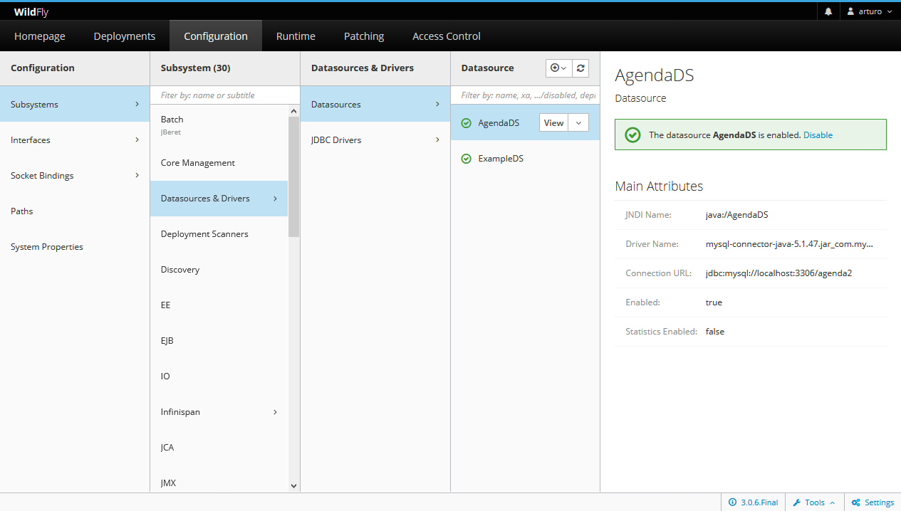

### Patrón service locator

Las aplicaciones utilizan la API JNDI Java Naming and Directory para buscar y crear componentes EJB y JMS. La API JNDI permite a los clientes obtener un objeto de contexto inicial que contiene el nombre del componente a los enlaces de objetos. El cliente comienza por obtener el contexto inicial para objeto home de un bean. El contexto inicial sigue siendo válida mientras que la sesión del cliente es válida. El cliente proporciona el nombre registrado JNDI del objeto requerido para obtener una referencia a un objeto administrado. En el contexto de una aplicación EJB, un objeto administrado típico es objeto home de un bean enterprise. Para aplicaciones JMS, el objeto administrado puede ser una fábrica de conexiones de JMS (para un tema o una cola) o de un destino JMS (un tema o una cola).
 
La localización de un objeto de servicio JNDI es común a todos los clientes que necesitan tener acceso a ese objeto de servicio. El **Service Locator** abstrae los servicios JNDI, las dependencias de proveedores, las complejidades de búsqueda y creación de objetos de negocio y proporciona una interfaz sencilla para los clientes

[Service Locator](http://www.juntadeandalucia.es/servicios/madeja/contenido/recurso/147)

